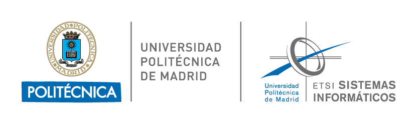

  
 
<h1 align="center">Deep Learning - Master in Deep Learning of UPM</h1> 

 Welcome to the official repository for the <strong>Deep Learning</strong> subject of the <a href="https://masterdeeplearning.etsisi.upm.es/">Master in Deep Learning</a> at the Universidad Politécnica de Madrid (UPM). 
 
 
<strong>Coordinator:</strong> Javier Huertas Tato   
<strong>Teachers:</strong> Javier Huertas Tato, Helena Líz López & Adrián Girón Jiménez 

## 📖 Course Content

### **Block 1: PyTorch Basics**
- 📘 Session 1: [Tensors](assignments/pytorch_basics/session_1)
- 📘 Session 2: [Modules](assignments/pytorch_basics/2_modules.ipynb)
- 📘 Session 3: [Data Handling](assignments/pytorch_basics/session_3)
- 📘 Session 4: [Logging & Inference](assignments/pytorch_basics/session_4)
- 📘 Session 5: [PyTorch Lightning](assignments/pytorch_basics/session_5)

### **Block 2: Convolutional Neural Networks (CNN)**
- 🖼️ Session 6: [Convolution](assignments/cnns/6_convolution.ipynb)
- 🖼️ Session 7: [Advanced Concepts](assignments/cnns/7_advanced_concepts.ipynb)

### **Block 3: Deep Learning for Sequential Data**
- 🔄 Session 9: [RNNs, LSTMs & GRUs](assignments/sequential/9_rnns_lstms_and_grus.ipynb)
- 🔄 Session 10: [Attention](assignments/sequential/10_attention.ipynb)
- 🔄 Session 11: [Transformers](assignments/sequential/11_transformers.ipynb)

## 📅 Schedule
Refer to the [schedule](https://masterdeeplearning.etsisi.upm.es/wp-content/uploads/2024/06/Horario-Master-Deep-Learning-UPM_v2.pdf) to check timings and plan your sessions.

